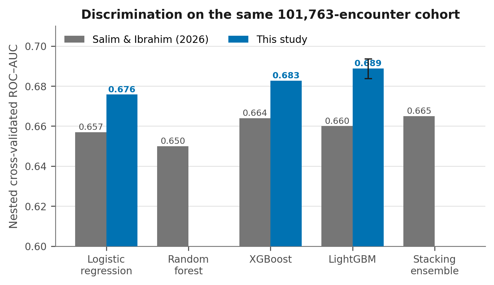
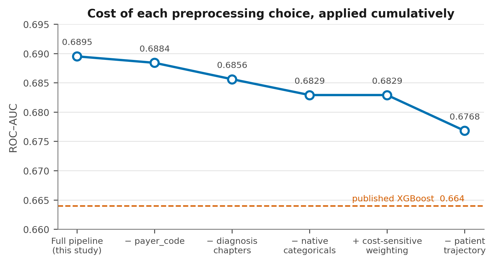
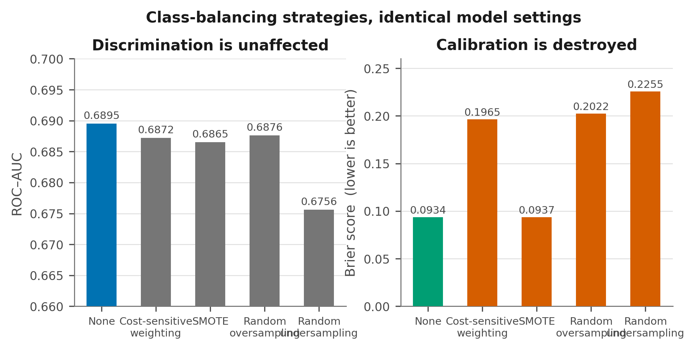
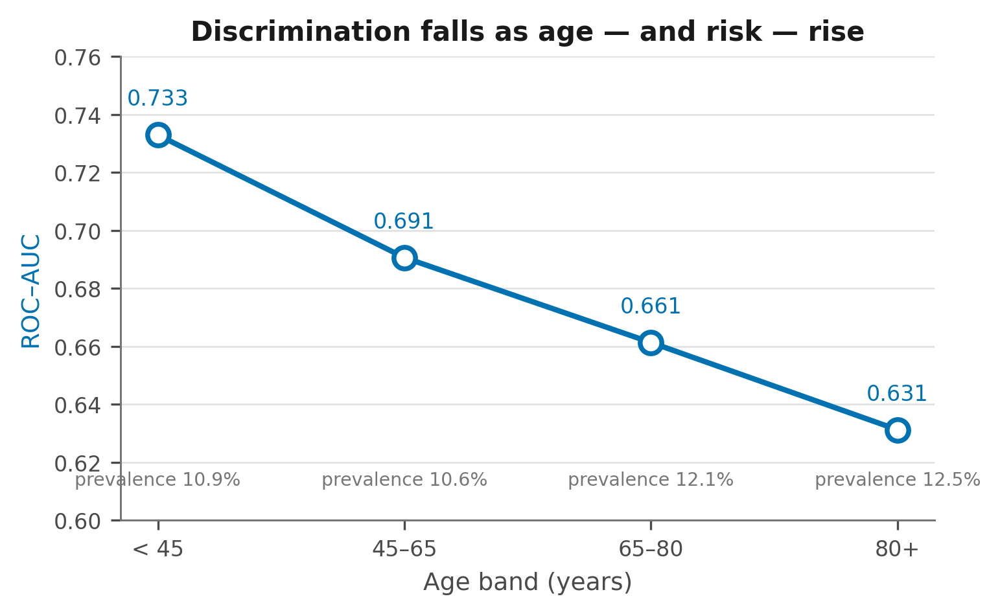
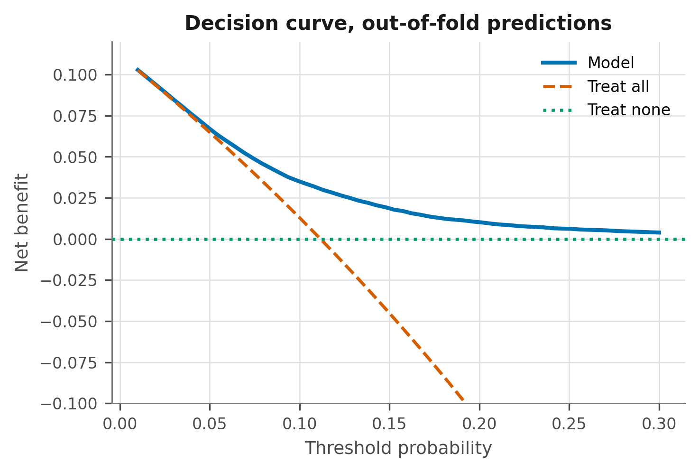
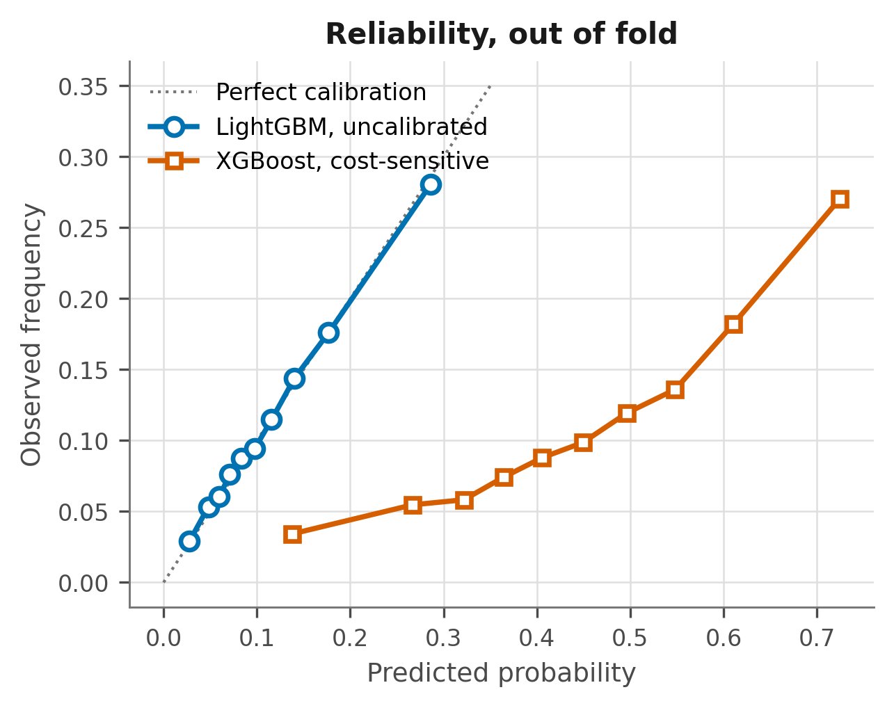

# Hospital Readmission Prediction — A Re-Analysis

> **METCS 577 · Boston University** — extended well past the original coursework


**[Live dashboard: Diabetes Readmissions, Care Transitions →](https://ryansingh0.github.io/hospital-readmission/)** An outreach-capacity planner, risk groups, an equity check and plain-language takeaways for quality-improvement teams, built from the out-of-fold predictions below.

**[Tableau Public: Readmission Outreach, Capacity and Model Evaluation →](https://public.tableau.com/app/profile/aryan.meena2899/viz/ReadmissionOutreachCapacityandModelEvaluation/Readmissionoutreach)** Pick an outreach capacity from 1% to 50% of encounters and see how many readmissions the model ranking finds versus random selection (top 5%: 1,696 readmissions, 3.00× random), plus subgroup AUC by age, race and sex and a calibration check by risk decile.

This began as a course project on a synthetic dataset. It changed direction once that dataset
turned out not to contain a real prediction problem, and ended up as a re-analysis of a published
benchmark on the Diabetes 130-US Hospitals cohort.

Two findings carry the work. A recent peer-reviewed result on this cohort can be improved on by
roughly 0.025 AUC, and **almost none of the improvement comes from the choice of model** — it comes
from how the cohort is defined and how a patient's prior encounters are represented. Separately,
transformer architectures in both of the forms tested here fail to match gradient boosting while
costing up to sixty-five times the training budget.

> **A note on the previous version of this README.** It reported a projected `$1.77M` annual saving
> per hospital and `$4.25B` system-wide. Those figures do not survive scrutiny — the arithmetic
> behind them assumed 2,400 false positives among 2,400 annual discharges, which is impossible, and
> the underlying dataset is synthetic. `docs/PRIOR_WORK_AUDIT.md` documents the full audit. The
> original notebook and README are preserved under `legacy/`.

---

## Headline result

Nested cross-validation, five outer folds grouped on patient identifier, three inner folds for
hyperparameter selection, on the same 101,763-encounter cohort as the published study.

| Model | This work | 95% CI | Salim & Ibrahim (2026) |
|---|---|---|---|
| **LightGBM** | **0.6888** | [0.6837, 0.6936] | 0.660 |
| XGBoost | 0.6827 | [0.6773, 0.6876] | 0.664 |
| Logistic regression | 0.6758 | [0.6706, 0.6808] | 0.657 |
| Stacking ensemble | not run | — | 0.665 |

Intervals are 95% bootstrap percentiles over 1,000 resamples. The paired difference between this
work's LightGBM and its own XGBoost is **+0.0062, 95% CI [+0.0041, +0.0082], p < 0.001**.

Notice that the margin is roughly constant across model families — logistic regression and XGBoost
each gain about 0.019 over their published counterparts. That is the signature of a data-side
rather than a model-side effect, which is what motivated the decomposition below.



---

## Where the improvement actually comes from

Each step applies a single decision taken by the prior work, so its cost can be read off directly.

| Configuration | ROC-AUC | PR-AUC | Brier |
|---|---|---|---|
| Full pipeline, this work | **0.6895** | 0.2404 | **0.0934** |
| − `payer_code` | 0.6884 | 0.2391 | 0.0935 |
| − ICD-9 chapters, binary flags instead | 0.6856 | 0.2341 | 0.0937 |
| − native categorical handling, one-hot instead | 0.6829 | 0.2295 | 0.0940 |
| + cost-sensitive weighting | 0.6829 | 0.2269 | **0.2053** |
| − patient-trajectory features | 0.6768 | 0.2244 | 0.2063 |

Patient trajectory is the largest single contributor at roughly 0.006 AUC. Native categorical
handling adds about 0.003, diagnosis chapters about 0.002.

Cost-sensitive weighting costs nothing in discrimination and **more than doubles the Brier score**.
That is the mechanism by which the prior work arrived at a poorly calibrated model needing a
post-hoc Platt correction — leaving the class distribution alone avoids the problem entirely.

About 0.013 of the gap from the published figure remains unattributed. The most likely sources are
the exact 55-predictor list, which is not published, and hyperparameter selection.



---

## Patient trajectory

Nearly thirty percent of encounters belong to a patient who appears more than once, and those
repeat encounters carry a readmission rate of **16.7% against 8.8%** for first presentations. Every
published model on this cohort treats rows as exchangeable.

| Feature set | ROC-AUC | PR-AUC | Brier |
|---|---|---|---|
| Cross-sectional only | 0.6851 | 0.2390 | 0.0935 |
| + encounter ordinal | 0.6889 | 0.2399 | 0.0934 |
| + full trajectory features | **0.6963** | **0.2489** | **0.0929** |

Trajectory modelling contributes **+0.0112 AUC**, which is larger than the combined contribution of
every other engineered feature family, and larger than the difference between any two model
families tested. Every trajectory feature applies a one-position shift before aggregation, so no
encounter observes itself or any later one.

A prior-outcome feature was built and then discarded — it contributed −0.0006 once the other
trajectory columns were present, and dropping it removes any question about outcome information
propagating along a patient's sequence.

---

## Cohort construction

```
101,766 encounters in the raw UCI export
 −  2,423 discharged to death or hospice
 −      3 unknown gender
=  99,340 encounters · 69,987 patients · 11.39% readmitted within 30 days
```

Removing terminal encounters is the one decision that warrants its own justification, because the
prior work takes the opposite view and retains them as an explicit predictor.

| Discharge disposition | n | 30-day readmission rate |
|---|---|---|
| 11 — Expired | 1,642 | **0.00%** |
| 13 — Hospice, home | 399 | 4.76% |
| 14 — Hospice, medical facility | 372 | 6.45% |
| Everyone else | 99,340 | 11.39% |

A patient who died cannot be readmitted. A model that learns to recognise these encounters gains
discrimination on people for whom the outcome was fixed at discharge. The published SHAP summary in
the comparator study shows its "Discharge: Expired" indicator as the largest-magnitude contributor.
Retaining them is worth about **0.007 AUC**, roughly one third of the margin by which that study
leads the earlier literature.

---

## Class balancing does not help

| Strategy | ROC-AUC | PR-AUC | Brier |
|---|---|---|---|
| **None, natural prevalence** | **0.6895** | **0.2403** | **0.0934** |
| Cost-sensitive weighting | 0.6872 | 0.2345 | 0.1965 |
| SMOTE | 0.6865 | 0.2366 | 0.0937 |
| Random oversampling | 0.6876 | 0.2347 | 0.2022 |
| Random undersampling | 0.6756 | 0.2168 | 0.2255 |

No scheme improves discrimination, and three of the four wreck calibration, because resampling and
reweighting both shift the training prior away from the deployment prior. At 11% prevalence with a
learner optimising log-loss, leaving the distribution alone and moving the threshold afterwards
dominates every alternative tested.



---

## Transformers, and the retrieval question

| Model | ROC-AUC | PR-AUC | Training time |
|---|---|---|---|
| **LightGBM** | **0.6662** | **0.1956** | **2 s** |
| Sequence Transformer, causal, over trajectories | 0.6463 | 0.1810 | 19 s |
| FT-Transformer, tabular | 0.6282 | 0.1741 | 131 s |

Measured on a 39,846-encounter patient-level subsample with a single held-out grouped split,
because the full cohort exceeds the available CPU budget.

The ordering within the two transformers is the informative part. The sequence model, which sees
each patient's history, beats the tabular model by 0.018 AUC — the trajectory signal is real enough
that a neural architecture recovers part of it unaided. Explicit trajectory features inside a
boosted tree recover more, at roughly one-sixtieth of the cost.

**Retrieval-augmented generation does not apply here**, and this repository does not pretend
otherwise. RAG retrieves passages from a text corpus to ground a language model. This dataset is
fifty columns of structured administrative codes with no clinical notes, discharge summaries, or
free text of any kind. There is nothing to retrieve.

---

## Subgroup performance

The comparator study lists subgroup analysis among the things it did not do. It is done here.

| Subgroup | n | Prevalence | ROC-AUC | Observed / predicted |
|---|---|---|---|---|
| Overall | 99,340 | 0.114 | 0.6813 | 1.015 |
| Age under 45 | 15,870 | 0.109 | **0.7329** | 1.039 |
| Age 45 to 65 | 39,118 | 0.106 | 0.6906 | 0.998 |
| Age 65 to 80 | 25,329 | 0.121 | 0.6613 | 1.020 |
| **Age 80 and over** | 19,023 | **0.125** | **0.6312** | 1.024 |
| African American | 18,772 | 0.114 | 0.6760 | 1.009 |
| Caucasian | 74,220 | 0.115 | 0.6804 | 1.020 |
| Female | 53,454 | 0.115 | 0.6828 | 1.014 |
| Male | 45,886 | 0.113 | 0.6795 | 1.017 |

**Discrimination declines monotonically with age while prevalence rises** — a gap of 0.102 between
the youngest and oldest bands. The model is weakest precisely where risk is highest, and where a
prevention programme would concentrate its effort.

No comparable disparity appears by race or sex, and calibration holds within every stratum, with
observed-over-predicted ratios between 0.93 and 1.04. The disparity is therefore one of
discrimination rather than calibration, which points the remedy toward age-stratified operating
thresholds rather than recalibration.



---

## Clinical utility

Out-of-fold, calibrated, base rate 11.39%.

| Target | Flagged | Captured | Recall | Precision | Lift |
|---|---|---|---|---|---|
| Top 5% | 4,967 | 1,696 | 15.0% | **34.1%** | **3.00×** |
| Top 10% | 9,934 | 2,764 | 24.4% | 27.8% | 2.44× |
| Top 20% | 19,868 | 4,517 | 39.9% | 22.7% | 2.00× |
| Top 30% | 29,802 | 5,973 | 52.8% | 20.0% | 1.76× |

Decision curve net benefit exceeds both treat-all and treat-none at every threshold between 0.05
and 0.30, computed entirely on out-of-fold predictions.



### Calibration needed no correction

Isotonic regression applied on top of the model made the Brier score slightly worse, 0.0953 to
0.0957, and discrimination slightly worse, 0.6826 to 0.6814. A gradient-boosting model trained on
the natural class distribution against a proper scoring rule is already calibrated.



---

## The synthetic dataset the project started from

The original coursework used a Kaggle synthetic file. Cross-tabulation recovers its generating rule
outright:

```
P(readmit) = 0.20  if (discharge ≠ Home) AND (diabetes OR hypertension)
             0.10  otherwise
```

9.98% across 23,157 rows against 19.92% across 6,843. A second comorbidity adds nothing, 19.96%
against 19.84%. Destination type adds nothing beyond "not Home", χ² p = 0.316. All five numeric
features are uniform over their support — age χ² p = 0.59, length of stay 0.63, medication
count 0.13, and BMI 0.20 once the two endpoint bins, which carry half weight because a
continuous uniform was rounded to one decimal, are set aside. They are noise by construction.

**The Bayes-optimal AUC of that dataset is 0.5814.** A three-variable logistic regression reaches
0.5809, statistically indistinguishable from the ceiling (p = 0.72 against an oracle). The original
coursework model reached 0.5654 using 1,609 features.

No model can do better on that file, which is why the project moved to real data.

---

## Layout

```
src/preprocessing.py            cohort construction and feature engineering
src/evaluation.py               metrics, bootstrap, decision curves, capacity tables
src/experiments/01..08          one script per result, each printing its own table
results/figures/                the seven figures above
docs/PAPER_DRAFT.md             manuscript draft, 22 references
docs/TRIPOD_AI_CHECKLIST.md     reporting checklist against TRIPOD+AI
docs/PRIOR_WORK_AUDIT.md        audit of the prior work, and of this project's own first version
docs/RESULTS_INDEX.md           every reported number mapped to the script producing it
docs/Readmission_Research_Report.docx   13-page report with all figures
legacy/                         the original coursework notebook and README
```

## Running it

```bash
pip install -r requirements.txt
# place diabetic_data.csv in data/ — see data/README.md
./run_all.sh
```

Roughly forty minutes on a laptop CPU, most of which is the deep-learning comparison in experiment
06. That one can be skipped without affecting any other result.

## Limitations

The cohort spans 1999 to 2008, predating the Hospital Readmission Reduction Program introduced in
2012. It is a methodological benchmark, not a deployable contemporary tool.

**No external validation was performed.** This is the principal limitation, and it is shared with
every study compared against. The claims here concern relative effects of modelling decisions
within one cohort.

Planned and unplanned readmissions cannot be distinguished in the source. Both transformers were
trained on a subsample with a modest CPU budget and no architecture search.

## Data

Neither dataset is redistributed. The Diabetes 130-US Hospitals cohort is available from the
[UCI Machine Learning Repository](https://archive.ics.uci.edu/dataset/296/diabetes+130-us+hospitals+for+years+1999-2008);
`data/README.md` has the details.

---

**Aryan Meena** · [LinkedIn](https://linkedin.com/in/aryan-meena-32685415a) · araj7042@gmail.com
